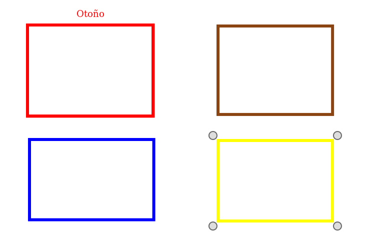
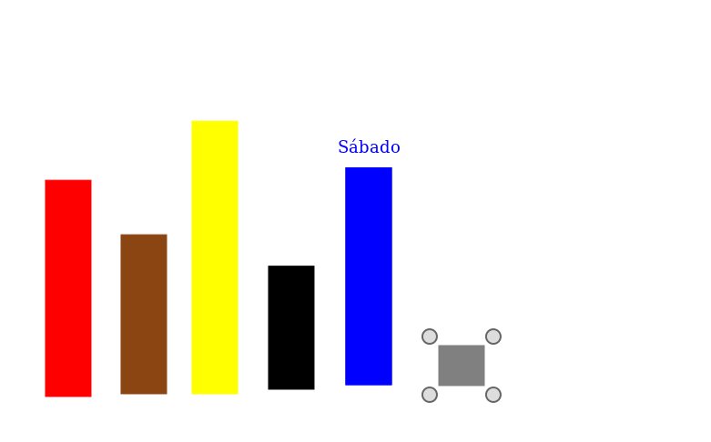
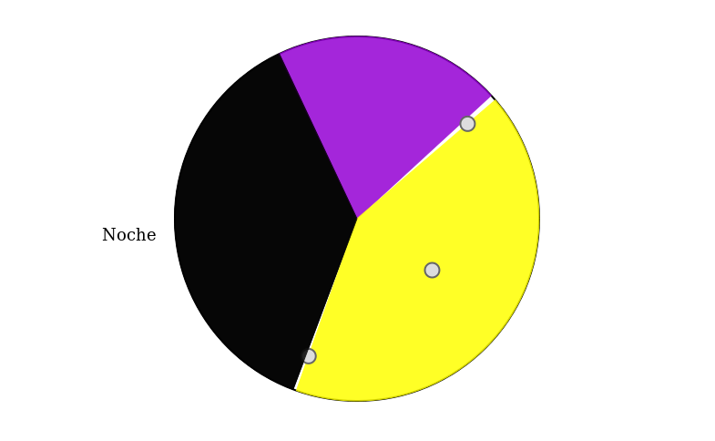
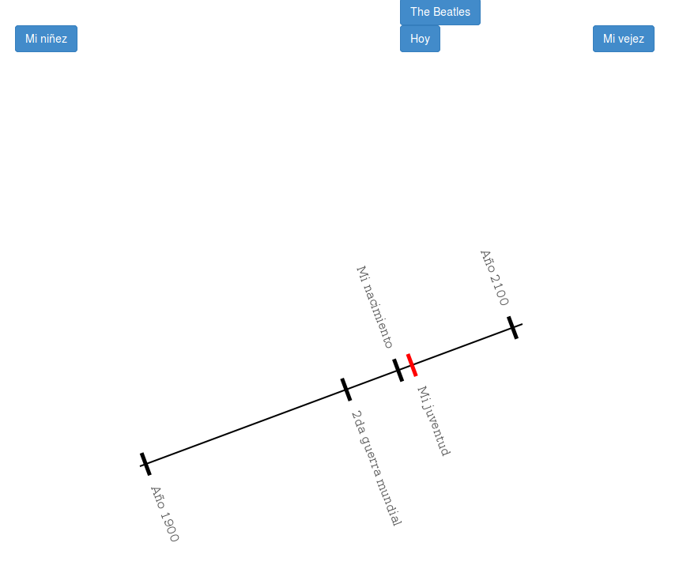

  
```{r global_options, include=FALSE}
library(knitr)
opts_chunk$set(echo=FALSE, warning=FALSE, message=FALSE, results='asis')
opts_knit$set(global.par=TRUE)
options(width=120)

library(pander)
panderOptions("table.split.table" , Inf) # avoid to split the tables
```

```{r import}
library(ggplot2)
library(GGally)
library(ggparallel)
library(broom)
library(gplots)
library(granovaGG)
library(circular)
library(lsr)
library(lme4)
library(lmerTest)
library(Deducer) # XXX: must be after lme4 to avoid an error
source("scripts/utils.R")
source("scripts/data_loading.R")
source("scripts/rsquaredglmm.R")

par(font.lab = 3, cex.lab = 1.1)

experiment_data = ExperimentData$new("data/output/")
experiments = experiment_data$flat_all()
```

# Presente, pasado y futuro


```{r}
current_stage = 'present_past_future'
long_stage = experiment_data$recursive(current_stage)
wide_stage = experiment_data$flat(current_stage)
```

## Tamaños del futuro/pasado y edad (N)

Para ver si existe relación entre ambos, estudiaremos la proporción en la cual el futuro es más grande o chico que el pasado, y luego la correlación de esta medida con la edad del sujeto.

```{r}
my_data = mutate(experiments, size_age_metric = my.relative_difference_log(
  present_past_future_radius_future, present_past_future_radius_past))

#ggplot(my_data, aes(x = questions_begining_age, y = size_age_metric)) +
#  geom_point(alpha = 0.3) + labs(x = "Edad", y = expression(RelDiff(Radio[Futuro], Radio[Pasado])))
```

Como tenemos algunos outliers vamos a quitar el 1% inicial y final de ambas variables. También vamos a excluír a los sujetos que hayan dejado algún radio por default.

```{r}
my_data = my.cut_outliers(my_data, c('questions_begining_age', 'size_age_metric'), 0.01)
my_data = filter(my_data, present_past_future_default_size == 0)

ggplot(my_data, aes(x = questions_begining_age, y = size_age_metric)) +
  geom_point(alpha = 0.3, position = position_jitter(w = 0.2, h = 0.2)) +
  labs(x = "Edad", y = expression(RelDiff(Radio[Futuro], Radio[Pasado])))
```

Regresión lineal para ver si disminuye con la edad.

```{r}
fit = lm(size_age_metric ~ questions_begining_age, my_data)
```

```{r, results='markup'}
summary(fit)
```

## Tamaño del presente y edad (N)

También podamos el 1% a ambos lados, y nos quedamos con quienes hayan elegido todos los radios distinos al default.

```{r}
my_data = my.cut_outliers(my_data, c('questions_begining_age', 'present_past_future_radius_present'), 0.01)
my_data = filter(my_data, present_past_future_default_size == 0)

ggplot(my_data, aes(x = questions_begining_age, y = present_past_future_radius_present)) +
  geom_point(alpha = 0.3, position = position_jitter(w = 0.2, h = 0.2)) +
  labs(x = "Edad", y = expression(Radio[Presente]))
```

Regresión lineal para ver si cambia con la edad.

```{r}
fit = lm(present_past_future_radius_present ~ questions_begining_age, my_data)
```

```{r, results='markup'}
summary(fit)
```


## Tiempo según orden de los botones (S)

Puede ser que los que eligieron los botones en orden *pasado_presente_futuro* hayan tardado más quienes no, si les mostró otro orden.

```{r}
my_data = experiments %>%
  filter(present_past_future_show_order != "past_present_future") %>%
  mutate(correctly_ordered = as.factor(present_past_future_select_order == "past_present_future")) %>%
  my.cut_outliers2(c("present_past_future_time_duration"), c(0, 0.95))
levels(my_data$correctly_ordered) = c("Ordenó", "No ordenó")

plotmeans(present_past_future_time_duration / 1000 ~ correctly_ordered, data = my_data,
          xlab = "Condición", ylab = "Tiempo en completar círculos (segundos)")
```

Test de diferencia de medias no paramétrico Mann-Whitney (ya que la distribución no parece normal).

```{r}
pander(tidy(wilcox.test(present_past_future_time_duration ~ correctly_ordered, data = my_data)))
```

## Orden de selección de botones y ubicación (S)

```{r}
my_replace = function(x) {
  my.multi_replace(list(
    c("past", "1"),
    c("present", "2"),
    c("future", "3")
  ),x)
}

df_table = mutate(experiments,
  select_order = my_replace(present_past_future_select_order),
  order_x = my_replace(present_past_future_order_x)
) %>% select(select_order, order_x)
```

Test G para descartar independencia entre el orden en que se eligieron los botones y el orden en que se ubicaron horizontalmente los elementos.

```{r}
result = with(df_table, likelihood.test(select_order, order_x))
pander(tidy(result))
```

Como podemos ver, de los que eligieron el orden "cronológico" una mayor proporción los ubicó en el mismo orden horizontal que los demás. Y es interesante que los demás, aunque no elijan de esa manera, los ubican con preferencia en el mismo orden en el espacio.

```{r}
ggally_ratio(df_table)
```

## Orden de inclusión en concéntricos (S)

```{r}
my_selection = wide_stage %>% filter(relatedness_cottle > 0.9) %>% select(experiment_id)
```

Algunos hicieron los círculos concéntricamente (unos dentro de otros). Son `r dim(my_selection)[1]` (`r 100 * dim(my_selection)[1] / dim(wide_stage)[1]`%).

```{r}
my_data = inner_join(long_stage, my_selection) %>%
  mutate(dominance_cottle = as.factor(dominance_cottle))
levels(my_data$element) = experiment_data$schema()$element_translation[[current_stage]]

ggplot(my_data, aes(x = dominance_cottle)) +
  geom_bar() + facet_grid(~ element) +
  labs(x = "Dominancia", y = "Cantidad")

#ggally_ratio(select(my_data, element, dominance_cottle))
```

Claramente el orden cronológico se manifiesta en los tamaños. Veamos con un G test.

```{r}
result = with(my_data, likelihood.test(element, dominance_cottle))
pander(tidy(result))
```

Asegurémosnos que no hay casos con dos círculos del mismo tamaño (bajo cierta tolerancia).

```{r}
#pander(dim(my_selection))
my_table = table(inner_join(wide_stage, my_selection)$dominance_group)
pander(data.frame(my_table))
```

## Radio de círculos según sexo (S)

Veamos si los hombres hacen los círculos más grandes que las mujeres, o viceversa. Para ello excluiremos los que fueron dejados con el tamaño por default.

```{r}
my_data = long_stage %>%
  inner_join(select(
    experiments, experiment_id = id, sex = questions_begining_sex,
    default_size_total = present_past_future_default_size)) %>%
  filter(default_size_total < 1)

plotmeans(radius ~ sex, my_data, xlab = "Sexo", ylab = "Radio", legends = c("Mujeres", "Hombres"))
```

```{r}
fit = lm(radius ~ sex, my_data)
```

```{r, results='markup'}
summary(fit)
```

# Estaciones del año



```{r}
current_stage = 'seasons_of_year'
long_stage = experiment_data$recursive(current_stage)
wide_stage = experiment_data$flat(current_stage)
```

## Ancho y alto (S)

El canvas es más ancho que alto (800x500), así que esto podría ser un sesgo. Aún así hay una tendencia del tamaño de las figuras a no ser cuadrado.

```{r}
my_selection = wide_stage %>% filter(default_size < 1) %>% select(experiment_id)
another_stage = inner_join(long_stage, my_selection)
my_df = mutate(another_stage, size_ratio = my.relative_difference_log(size_x, size_y))
```

Veamos la distribución de la diferencia relativa entre tamaño en X e Y.

```{r}
ggplot(my_df, aes(x = size_ratio)) +
  geom_histogram(binwidth = 0.1, color="grey40", fill="#00aeff", alpha = 0.7) +
  labs(x = expression(RelDiff(Tamaño[X], Tamaño[Y])), y = "Cantidad")
```

Test de Wilcoxon para la media mayor a cero.

```{r}
pander(tidy(wilcox.test(my_df$size_ratio, alternative = "greater")))
```

# Días de la semana



## Dónde empieza: lunes o domingo (S)

La variable `order_x` indica si siguen el orden normal de lunes a domingo o domingo a sábado, mirando solamente el eje X. La otra alternativa es que no esté ordenada en ese eje.

```{r, fig.height=2.5}
my_data = experiments[!is.na(experiments$days_of_week_order_x),]
levels(my_data$days_of_week_order_x) = c("Lunes a Domingo", "Otro", "Domingo a Sábado")

ggplot(my_data, aes(x = days_of_week_order_x)) +
  geom_bar(color="grey40", fill="#00aeff", alpha = 0.7) +
  labs(x = "Orden", y = "Cantidad") + coord_flip()
```

Si quitamos quienes eligieron otro orden (posiblemente con componente vertical), queda lo siguiente.

```{r}
my_table = my.frequency_table(filter(my_data, days_of_week_order_x != "Otro")$days_of_week_order_x)
pander(my_table)
```

Y test binomial para diferenciar la probabilidad de `0.5`.

```{r}
successes = my_table$Cantidad[1]
trials = sum(my_table$Cantidad)
pander(tidy(binom.test(successes, trials, 0.5)))
```

## Dónde empieza y edad (N)

Teníamos la hipótesis de que las personas de más edad utilizaban el Domingo primero, posiblemente por tradición.

```{r}
plotmeans(questions_begining_age ~ days_of_week_order_x, my_data,
          xlab = "Orden horizontal", ylab = "Edad")
```

Hagamos un test ANOVA.

```{r}
fit = lm(questions_begining_age ~ days_of_week_order_x, my_data)

pander(glance(fit))
pander(tidy(anova(fit)))
pander(tidy(TukeyHSD(aov(fit))))
```

Es curioso que si bien no hay evidencia de que la edad afecte si empieza en Lunes o Domingo, si afecta la tercera opción. Ahí entran los casos en que hubo orden vertical (por ejemplo, sábado y domingo más abajo que el resto en una segunda fila) y los secuenciales fuera de orden.

# Partes del día



## Orden: horario o antihorario (S)

Veamos qué porcentaje hay de *horario* y *antihorario*.

```{r}
my_table = my.frequency_table(experiments$parts_of_day_order)
pander(my_table)
```

Y el test binomial para diferenciar la probabilidad de `0.5`.

```{r}
successes = my_table$Cantidad[1]
trials = sum(my_table$Cantidad)
pander(tidy(binom.test(successes, trials, 0.5)))
```

# Línea de tiempo



## Inclinación significativa de la línea (S)

Test de Rayleigh para uniformidad de datos circulares.

```{r, results='markup'}
line_rotation = circular(experiments$timeline_line_rotation, units = "degrees")

rayleigh.test(line_rotation)
```

```{r}
line_rotation_density = density.circular(line_rotation, bw = 200, na.rm = T)
line_rotation_mean = mean.circular(line_rotation, na.rm = T)
line_rotation_ci = mle.vonmises.bootstrap.ci(line_rotation)

plot(line_rotation_density, col = "#777777", shrink = 1.4, offset = 1.1, main = "", xlab="", ylab="")
arrows.circular(line_rotation_mean, col = "#777777")
#ticks.circular(line_rotation_ci$mu.ci, tcl = 0.2, col = 2)
```

```{r, results='markup'}
line_rotation_mean %>% as.vector()
line_rotation_ci$mu.ci %>% as.data.frame() %>% t()
```

## Dirección unidimensional del tiempo (S)

Veamos qué porcentaje hay de cada uno.

```{r}
my_table = my.frequency_table(experiments$timeline_order)
pander(my_table)
```

Y el test binomial para diferenciar la probabilidad de `0.5`.

```{r}
successes = my_table$Cantidad[1]
trials = sum(my_table$Cantidad)
pander(tidy(binom.test(successes, trials, 0.5)))
```

## Edad real y edad según la línea (S)

Definimos una métrica en base a la diferencia entre el nacimiento y hoy, relativo a la diferencia entre el año 1900 y 2000 para convertirlo a años.

```{r}
timeline_scale = with(experiments, 200 / (timeline_position_year_2100 - timeline_position_year_1900))

my_data = mutate(experiments,
  age_from_timeline = (timeline_position_today - timeline_position_my_birth) * timeline_scale,
  remaining_years = (timeline_position_my_third_age - timeline_position_today) * timeline_scale
)

my_data = my.cut_outliers(my_data, c("questions_begining_age"), 0.01)
my_data = filter(my_data, age_from_timeline > 0, age_from_timeline < 100)
my_data = filter(my_data, remaining_years > 0, remaining_years < 200)
my_data_timeline = my_data
```

Podando el 1% en la edad (real) y sacando outliers en la métrica estimada (mayor a 0 y menor a 100).

```{r}
ggplot(my_data_timeline, aes(x = questions_begining_age, y = age_from_timeline)) +
  geom_jitter(alpha = 0.5) + geom_smooth(method=lm) +
  labs(x = "Edad real", y = "Edad subjetiva (según la línea)")
```

Regresión lineal a ver si hay una correlación positiva.

```{r}
fit = lm(age_from_timeline ~ questions_begining_age, data = my_data_timeline)
pander(confint(fit))
```

```{r, results='markup'}
summary(fit)
```

## Tiempo de vida restante según edad (S)

Como no disponemos del evento "mi muerte" por obvias razones, podemos utilizar como estimador del tiempo restante de vida la diferencia entre "hoy" y "mi vejez". Esto excluirá a quienes ubicaron el día actual posterior a la vejez, claro.

Luego de podar el 1% en la edad, y sacar outliers en la métrica (valores que no estén dentro de 0 y 200), queda lo siguiente.

```{r}
ggplot(my_data_timeline, aes(x = questions_begining_age, y = remaining_years)) +
  geom_jitter(alpha = 0.5) + geom_smooth(method=lm) +
  labs(x = "Edad real", y = "Años subjetivos para la vejez")

#ggplot(my_data_timeline, aes(x = questions_begining_age, y = remaining_years)) +
#  geom_histogram(alpha = 0.5, breaks = seq(18,80,by=15)) + geom_density() +
#  labs(x = "Edad real", y = "Años subjetivos para la vejez")
```

Regresión lineal a ver si hay una correlación negativa.

```{r}
fit = lm(remaining_years ~ questions_begining_age, data = my_data_timeline)
pander(confint(fit))
```

```{r, results='markup'}
summary(fit)
```

## Compresión y expansión del tiempo (S)

Tenemos una medida subjetiva y objetiva de la fecha de nacimiento y de hoy, ya que tenemos la edad y la fecha. Pero en cuanto a la muerte (o vejez, que estamos utilizando como reemplazo) sólo tenemos una medida subjetiva según la línea.

Por lo tanto, de los 4 intervalos que estimaremos (*pasado ajeno*, *pasado propio*, *futuro propio* y *futuro ajeno*), los dos últimos cambiarán según cómo consideremos la vejez. Para eso vamos a suponer que el zoom del *futuro propio* es igual al del *pasado propio*.

**Nota**: no hay efectos aleatorios signficativos, por lo que no usamos modelos de efectos mixtos.

En años subjetivos según la línea (aquí no asumimos nada).

```{r, fig.width=10}
my_data = experiments %>% my.get_time_ratios2() %>% my.get_absolute_time()
levels(my_data$variable) = c("Pasado ajeno", "Pasado propio", "Futuro propio", "Futuro ajeno")

p1 = ggplot(my_data, aes(y = value, x = variable)) +
  geom_jitter(alpha = 0.4) + labs(x = "", y = "Años subjetivos")
p2 = ggplot(my_data, aes(y = value, x = variable, color = sex)) +
  geom_boxplot(outlier.shape = NA) + guides(color=FALSE) +
  labs(x = "", y = "Años subjetivos")

grid.arrange(p1, p2, ncol=2)
```

```{r}
fit = lm(value ~ variable*sex, data = my_data)

pander(glance(fit))
#pander(tidy(anova(fit)))
pander(etaSquared(fit, anova = T) %>% as.data.frame())
```

Estimando la vejez como se dijo anteriormente.

```{r, fig.width=10}
my_data = experiments %>% my.get_time_ratios2() %>% my.get_derivative_time()
my_data = my_data[complete.cases(my_data),]
levels(my_data$variable) = c("Pasado ajeno", "Pasado propio", "Futuro propio", "Futuro ajeno")

p1 = ggplot(my_data, aes(y = value, x = variable)) + geom_jitter(alpha = 0.4) +
  labs(x = "", y = expression(RelDiff(Años[Reales], Años[Subjetivos])))
p2 = ggplot(my_data, aes(y = value, x = variable, color = sex)) +
  geom_boxplot(outlier.shape = NA) + guides(color=FALSE) +
  labs(x = "", y = expression(RelDiff(Años[Reales], Años[Subjetivos])))

grid.arrange(p1, p2, ncol=2)
```

```{r}
fit = lm(value ~ variable*sex, data = my_data)

pander(glance(fit))
#pander(tidy(anova(fit)))
pander(etaSquared(fit, anova = T) %>% as.data.frame())
```

Veamos la distribución de la vejez estimada para que las escalas coincidan.

```{r}
blah = experiments %>% my.get_time_ratios2()
blah = blah[complete.cases(blah),]

ggplot(blah, aes(x = estimated_third_age)) + geom_histogram(aes(y = ..density..), alpha = 0.5) + geom_density()
```

```{r, results='markup', echo=T}
mean(blah$estimated_third_age)
sd(blah$estimated_third_age)
```

## Distorsión del pasado según sexo

```{r}
my_data = my.get_time_ratios2(experiments, diff = my.relative_difference_log)
my_data_diff = my.get_derivative_time2(my_data)
levels(my_data_diff$sex) = c("Mujeres", "Hombres")
```

Para el pasado propio.

```{r}
blah = filter(my_data_diff, variable == "own_past_length")
plotmeans(value ~ sex, blah, main = "Pasado propio",
          xlab = "Sexo", ylab = expression(RelDiff(Años[Reales], Años[Subjetivos])))
```

```{r}
fit = lm(value ~ sex, blah)
cbind(OR = coef(fit), confint(fit)) %>% exp() %>% pander()
```

```{r, results='markup'}
summary(fit)
```

Para el pasado ajeno.

```{r}
blah = filter(my_data_diff, variable == "other_past_length")
plotmeans(value ~ sex, blah, main = "Pasado ajeno",
          xlab = "Sexo", ylab = expression(RelDiff(Años[Reales], Años[Subjetivos])))
```

```{r}
fit = lm(value ~ sex, blah)
cbind(OR = coef(fit), confint(fit)) %>% exp() %>% pander()
```

```{r, results='markup'}
summary(fit)
```

Veamos la comparación de la desviación de "mi nacimiento" a la recta entre "año 1900" y "hoy".

```{r}
my_data = my.get_time_ratios3(experiments) %>% mutate(
  year_1900_x = -real_other_past - real_own_past,
  year_1900_y = -subjective_other_past - subjective_own_past,
  my_birth_x = -real_own_past,
  my_birth_y = -subjective_own_past,
  today_x = 0,
  today_y = (subjective_own_past + subjective_own_future) / 2,
  line_offset = my_birth_y - line_eval_from_points(year_1900_x, year_1900_y, today_x, today_y, my_birth_x)
)
levels(my_data$questions_begining_sex) = c("Mujeres", "Hombres")

#hist(my_data$line_offset)
plotmeans(line_offset ~ questions_begining_sex, my_data,
          xlab = "Sexo", ylab = "Diferencia con la recta")
```

```{r, fig.width=8}
p1 = ggplot(my_data, aes(x = line_offset, colour = questions_begining_sex)) +
  stat_ecdf(geom='line') + theme(legend.position="top") +
  scale_color_discrete(name="Sexo") + labs(x = "Distancia a la linea", y = "P(X < x)")
p2 = ggplot(my_data, aes(x = line_offset, colour = questions_begining_sex)) +
  geom_density() + theme(legend.position="top") +
  scale_color_discrete(name="Sexo") + labs(x = "Distancia a la linea", y = "Densidad")
grid.arrange(p1, p2, ncol = 2)
```

```{r}
ggplot(my_data, aes(x = my_birth_x, y = my_birth_y, colour = questions_begining_sex)) +
  geom_point() + theme(legend.position="top") +
  scale_color_discrete(name="Sexo")
```

```{r}
fit = lm(line_offset ~ questions_begining_sex, my_data)

pander(confint(fit))
```

```{r, results='markup'}
summary(fit)
```

## Edad real y vejez percibida (S)

Veamos si al hacerse más viejo uno estima su vejez más lejos que cuando era joven (tomando en cuenta cuánto mide desde "mi nacimiento" hasta "hoy" comparado con la edad real).

```{r}
my_data = mutate(experiments,
  own_past = (timeline_position_today - timeline_position_my_birth) * timeline_scale,
  own_time = (timeline_position_my_third_age - timeline_position_my_birth) * timeline_scale,
  my_third_age_estimate = own_time * (questions_begining_age / own_past)
) %>% filter(
  my_third_age_estimate > 0,
  questions_begining_age > 18,
  my_third_age_estimate > questions_begining_age,
  my_third_age_estimate < 200
) %>% my.cut_outliers(c("questions_begining_age"), 0.01)

ggplot(my_data, aes(x = questions_begining_age, y = my_third_age_estimate)) +
  geom_jitter(alpha = 0.5) + geom_smooth(method=lm) +
  labs(x = "Edad real", y = "Estimación subjetiva de la vejez") + coord_equal()
```

Ahora veamos el test de ANOVA.

```{r}
fit = lm(my_third_age_estimate ~ questions_begining_age, my_data)
```

```{r, results='markup'}
summary(fit)
```

# Entre etapas

## Tamaño del pasado y edad subjetiva (N)

```{r}
my_data = my_data_timeline %>% filter(present_past_future_default_size == 0)

ggplot(my_data, aes(x = present_past_future_radius_past, y = age_from_timeline)) +
  geom_jitter(alpha = 0.5) + geom_smooth(method=lm) +
  labs(x = "Radio del pasado", y = "Edad subjetiva")
```

```{r}
fit = lm(age_from_timeline ~ present_past_future_radius_past, data = my_data)
```

```{r, results='markup'}
summary(fit)
```

## Tamaño del futuro y tiempo restante subjetivo (N)

```{r}
ggplot(my_data, aes(x = present_past_future_radius_future, y = remaining_years)) +
  geom_jitter(alpha = 0.5) + geom_smooth(method=lm) +
  labs(x = "Radio del futuro", y = "Tiempo restante subjetivo (años)")
```

```{r}
fit = lm(remaining_years ~ present_past_future_radius_future, data = my_data)
```

```{r, results='markup'}
summary(fit)
```

## Colores entre hombres y mujeres (S)

```{r}
my_data = my.combined_columns2(experiment_data, c("color", "num_color_changes"))
my_data = inner_join(my_data, select(experiments,
  experiment_id = id, sex = questions_begining_sex))
levels(my_data$color) = experiment_data$schema()$color_translation
```

```{r}
my_props = xtabs(~ color + sex, my_data) %>% prop.table(margin = 2)
ggplot(data.frame(my_props), aes(y = Freq, x = color, fill = sex)) +
  geom_bar(stat = "identity", position = "dodge", alpha = 0.6) +
  theme(legend.position="top") +
  labs(y = "Proporción", x = "Color") +
  scale_fill_discrete(name = "Sexo", labels = c("Mujeres", "Hombres"))
```

```{r}
freq_table = xtabs(~ color + stage + sex, my_data)
fit = glm(Freq ~ color*stage*sex,
  data.frame(freq_table), family = poisson)
```

```{r, results='markup'}
anova(fit, test='Chisq')
```

### Con defaults

Podría ser que la diferencia en el uso del negro entre hombres y mujeres se deba a que simplemente los hombres lo dejar por default (que viene negro) en mayor proporción.

Para comprobar esto, estudiaremos la probabilidad de elegir un color según el sexo mediante regresión logística.

```{r}
my_data = my.combined_columns2(experiment_data,
  c("num_color_changes", "num_selects", "num_moves", "num_resizes", "total_events"))
my_data = inner_join(my_data, select(experiments,
  experiment_id = id, sex = questions_begining_sex))
levels(my_data$sex) = c("Mujeres", "Hombres")

plotmeans(num_color_changes > 0 ~ sex, my_data, xlab = "Sexo", ylab = "Proporción distinta de negro")
```

```{r}
fit = glmer(num_color_changes > 0 ~ sex + (1|experiment_id) + (1|stage), data=my_data, family=binomial)

pander(my.confint.melogit(fit) %>% exp())
```

```{r, results='markup'}
summary(fit)
Anova(fit)
rsquared.glmm(fit)
```

Podríamos extender la hipótesis anterior a que de hecho las mujeres ajustaban más las figuras que los hombres. Así que veamos la cantidad de eventos, dividida por el número de elementos según la etapa (para intentar que los valores pertenezcan a la misma distribución).

```{r}
my_data2 = my_data %>% group_by(experiment_id, stage, sex) %>% summarize(
  num_color_changes = sum(num_color_changes) / n(),
  total_events = sum(total_events) / n()
)
levels(my_data2$sex) = c("Mujeres", "Hombres")

plotmeans(total_events ~ sex, my_data2, xlab = "Sexo", ylab = "Cantidad de cambios de color")
```

```{r}
fit = lm(total_events ~ sex, my_data2)
```

```{r, results='markup'}
summary(fit)
```

### Sin defaults

Ahora que vimos que la diferencia del negro se debe a que los hombres los dejan como están y no eligen, veamos qué ocurre si sólo dejamos sólo a quienes eligieron algún color.

```{r}
my_data = my.combined_columns2(experiment_data, c("color", "num_color_changes"))
my_data = inner_join(my_data, select(experiments,
  experiment_id = id, sex = questions_begining_sex))
my_data = my_data %>% filter(num_color_changes > 0)
levels(my_data$color) = experiment_data$schema()$color_translation
```

```{r}
my_props = xtabs(~ color + sex, my_data) %>% prop.table(margin = 2)
ggplot(data.frame(my_props), aes(y = Freq, x = color, fill = sex)) +
  geom_bar(stat = "identity", position = "dodge", alpha = 0.6) +
  theme(legend.position="top") +
  labs(y = "Proporción", x = "Color") +
  scale_fill_discrete(name = "Sexo", labels = c("Mujeres", "Hombres"))
```

```{r}
freq_table = xtabs(~ color + stage + sex, my_data)
fit = glm(Freq ~ color*stage*sex,
  data.frame(freq_table), family = poisson)
```

```{r, results='markup'}
anova(fit, test='Chisq')
```

## Cosmocéntricos y ahoracéntricos vs existencia en la línea (N)

Podríamos llamar "cosmocéntricos" a quienes hacen el presente más pequeño que el pasado y el futuro, y "ahoracéntricos" a quienes hacen el presente más grande que los anteriores. El resto quedará en un grupo llamado "otros".

Observar que sacaremos a quienes no eligieron tamaños. No hubo diferencias entre sexos para los grupos (excepto que en "otros" hay 240M contra 304H).

```{r}
circulos_df = experiment_data$flat('present_past_future') %>% filter(default_size < 1)
#circulos_df = inner_join(circulos_df, select(experiments, experiment_id = id, sex = questions_begining_sex))
circulos_df[["centro_presente"]] = "otros"

#circulos_df[with(circulos_df, dominance_cottle == 0),]$centro_presente = "iguales"
circulos_df[with(circulos_df, dominance_cottle_present >= 2/3),]$centro_presente = "ahoracentricos"
circulos_df[with(circulos_df, dominance_cottle_present == 0 & dominance_cottle_future > 0 & dominance_cottle_past > 0),]$centro_presente = "cosmocentricos"

pander(data.frame(my.frequency_table(circulos_df$centro_presente)))
```

Para evaluar en qué grado es más o menos grande el presente, veamos la siguiente métrica: la diferencia relativa entre el tamaño del presente y el promedio entre pasado y futuro. Siendo "diferencia relativa", el logaritmo de la razón entre ambos. Los positivos son quienes hicieron el presente más grande.

```{r}
circulos_df = mutate(circulos_df, centro_presente_continuo =
  my.relative_difference_log(radius_present, (radius_past + radius_future)/2))
#qplot(centro_presente_continuo, data = circulos_df %>% filter(default_size < 1))
ggplot(circulos_df, aes(x = centro_presente_continuo, fill = centro_presente)) +
  geom_histogram(position = 'dodge')
```

Ahora veamos con un ANOVA si la diferencia entre los grupos es significativa.

```{r}
timeline_df = experiment_data$flat('timeline') %>%
  inner_join(select(experiments, experiment_id = id, age = questions_begining_age))
timeline_df = mutate(timeline_df,
  tiempo_total = position_year_2100 - position_year_1900,
  tiempo_vivido = position_today - position_my_birth,
  ratio_existencia = (tiempo_vivido / age) / (tiempo_total / 200)
) %>% filter(ratio_existencia > 0, ratio_existencia < 1)
timeline_df = inner_join(timeline_df, select(circulos_df, experiment_id, centro_presente))

ggplot(timeline_df, aes(y = ratio_existencia, x = centro_presente)) + geom_boxplot() + geom_jitter(aes(color=centro_presente), alpha = 0.5)
plotmeans(ratio_existencia ~ centro_presente, timeline_df)
```

```{r}
fit = lm(ratio_existencia ~ centro_presente, timeline_df)

pander(glance(fit))
pander(tidy(anova(fit)))
pander(tidy(TukeyHSD(aov(fit))))
```

# Cronotipos


\includegraphics[width=250pt]{imagenes/cronotipos.jpg}

```{r}
chronotypes = experiment_data$chronotypes()
my_data_chrono = inner_join(experiments, chronotypes, by = c("id" = "experiment_id"))

my_data_chrono$parts_of_day_rotation_morning = circular(my_data_chrono$parts_of_day_rotation_morning, units = "degrees")
my_data_chrono$parts_of_day_rotation_afternoon = circular(my_data_chrono$parts_of_day_rotation_afternoon, units = "degrees")
my_data_chrono$parts_of_day_rotation_night = circular(my_data_chrono$parts_of_day_rotation_night, units = "degrees")

levels(my_data_chrono$questions_ending_cronotype) = experiment_data$schema()$chronotypes_translation
```

## Tamaño de mañana/noche y cronotipo (S)

Veremos si los puntajes de los sujetos se relacionan con la diferencia relativa entre el tamaño de la mañana y la noche.

```{r}
my_data = my_data_chrono %>%
  mutate(morning_night = my.relative_difference_log(parts_of_day_size_morning, parts_of_day_size_night))
```

Para *MEQscore*.

```{r}
ggplot(my_data, aes(x = MEQscore, y = morning_night)) +
  geom_point(alpha = 0.7) + geom_smooth(method=lm) +
  ylab(expression(RelDiff(Tamaño[Mañana], Tamaño[Noche])))
```

```{r}
fit = lm(morning_night ~ MEQscore, my_data)
```

```{r, results='markup'}
summary(fit)
```

Para *MSFsc*.

```{r}
ggplot(my_data, aes(x = MSFsc, y = morning_night)) +
  geom_point(alpha = 0.7) + geom_smooth(method=lm) +
  ylab(expression(RelDiff(Tamaño[Mañana], Tamaño[Noche])))
```

```{r}
fit = lm(morning_night ~ MSFsc, my_data)
```

```{r, results='markup'}
summary(fit)
```

## Tamaño de mañana/noche y preferencias diurnas (S)

Esperamos que quienes dijeron ser "muy matutinos" hayan hecho la mañana más grande que la noche (o la tarde), por ejemplo. En este caso compararemos la diferencia entre mañana y noche (sobre su suma).

```{r, fig.width=8}
my_data = mutate(experiments, morning_night =
  my.relative_difference_log(parts_of_day_size_morning, parts_of_day_size_night))
levels(my_data$questions_ending_cronotype) = experiment_data$schema()$chronotypes_translation

plotmeans(morning_night ~ questions_ending_cronotype, my_data,
  xlab = "Preferencias diurnas", ylab = expression(RelDiff(Tamaño[Mañana], Tamaño[Noche])))
```

Veamos un ANOVA.

```{r}
fit = lm(morning_night ~ questions_ending_cronotype, my_data)

pander(tidy(anova(fit)))
```

```{r, results='markup'}
summary(fit)
```

## Relación entre ambas métricas (S)

Las variables `MEQscore` y `MSFsc` deberían tener alguna relación.

```{r}
ggplot(chronotypes, aes(x = MEQscore, y = MSFsc)) + geom_point() + geom_smooth(method=lm)
```

Veamos con un modelo lineal.

```{r}
fit = lm(MSFsc ~ MEQscore, data=chronotypes)
```

```{r, results='markup'}
summary(fit)
```

## Relación entre cronotipos y preferencias diurnas (S)

Utilizando MEQscore.

```{r, fig.width=8}
plotmeans(MEQscore ~ questions_ending_cronotype, my_data_chrono, xlab = "Preferencias diurnas")
```

```{r}
fit = lm(MEQscore ~ questions_ending_cronotype, my_data_chrono)

pander(tidy(anova(fit)))
```

```{r, results='markup'}
summary(fit)
```

Utilizando MSFsc.

```{r}
plotmeans(MSFsc ~ questions_ending_cronotype, my_data_chrono, xlab = "Preferencias diurnas")
```

```{r}
fit = lm(MSFsc ~ questions_ending_cronotype, my_data_chrono)
pander(tidy(anova(fit)))
```
```{r, results='markup'}
summary(fit)
```

## Similitud entre respuestas sobre preferencias diurnas (S)

Utilizaremos la pregunta de cronotipos considerada como numérica, y la compararemos con la de este experimento.

```{r, fig.width=8}
plotmeans(chrono_question ~ questions_ending_cronotype, my_data_chrono,
          xlab = "Preferencias diurnas", ylab = "Cuestionario cronotipos")
```

```{r}
fit = lm(chrono_question ~ questions_ending_cronotype, my_data_chrono)

pander(tidy(anova(fit)))
```

```{r, results='markup'}
summary(fit)
```

## Relación entre cronotipos y tamaño de círculos (N)

Veamos entre `MEQscore` y el radio del presente.

```{r}
fit = lm(MEQscore ~ present_past_future_radius_present, data = my_data_chrono)
```

```{r, results='markup'}
summary(fit)
```

Veamos entre `MEQscore` y el radio del futuro.

```{r}
fit = lm(MEQscore ~ present_past_future_radius_future, data = my_data_chrono)
```

```{r, results='markup'}
summary(fit)
```

## Sentido del día y cronotipos (N)

Veamos si cambia el orden de las partes del día (horario o antihorario) según el `MEQscore`.

```{r}
#plotmeans(MEQscore ~ parts_of_day_order, data = my_data_chrono)
```

```{r}
fit = lm(MEQscore ~ parts_of_day_order, data = my_data_chrono)
```

```{r, results='markup'}
summary(fit)
```

## Ubicación de partes del día y cronotipos (S)

Para la mañana.

```{r, results='markup'}
fit = with(my_data_chrono, lm.circular(
  y = parts_of_day_rotation_morning, x = MEQscore, init = c(0), type = "c-l", tol=1e-5
))

fit
```

Para la tarde.

```{r, results='markup'}
fit = with(my_data_chrono, lm.circular(
  y = parts_of_day_rotation_afternoon, x = MEQscore, init = c(0), type = "c-l", tol=1e-5
))

fit
```

Para la noche.

```{r, results='markup'}
fit = with(my_data_chrono, lm.circular(
  y = parts_of_day_rotation_night, x = MEQscore, init = c(0), type = "c-l", tol=1e-5
))

fit

# fitLL2 = with(my_data_chrono, kern.reg.lin.circ(MEQscore, parts_of_day_rotation_morning))
# plot(fitLL2, plot.type="line", points.plot=TRUE, units="degrees", main="", ylim=c(0,360))
```