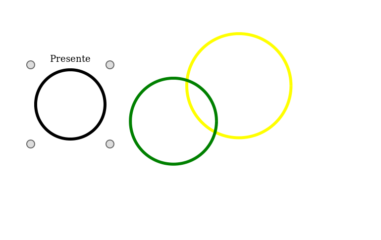
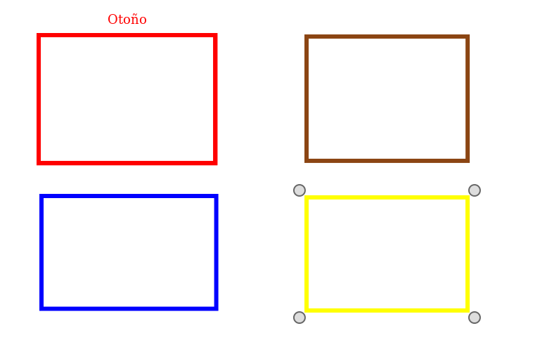
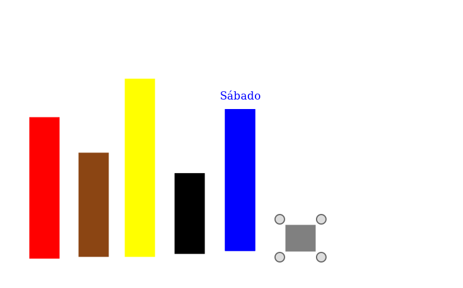
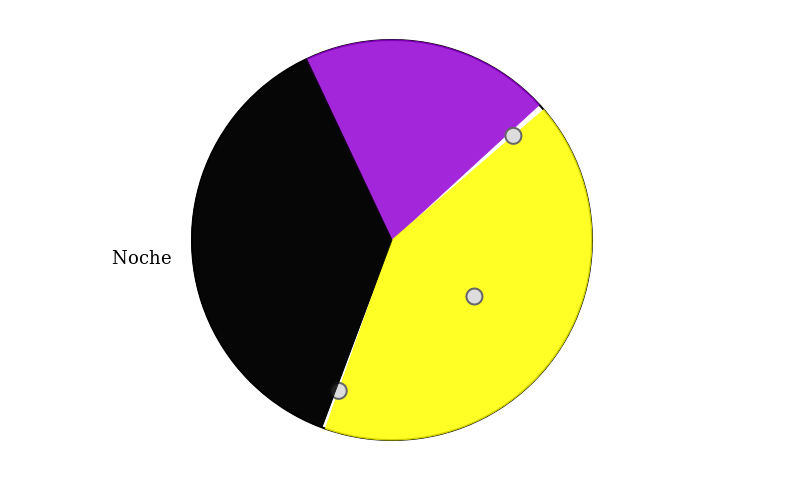
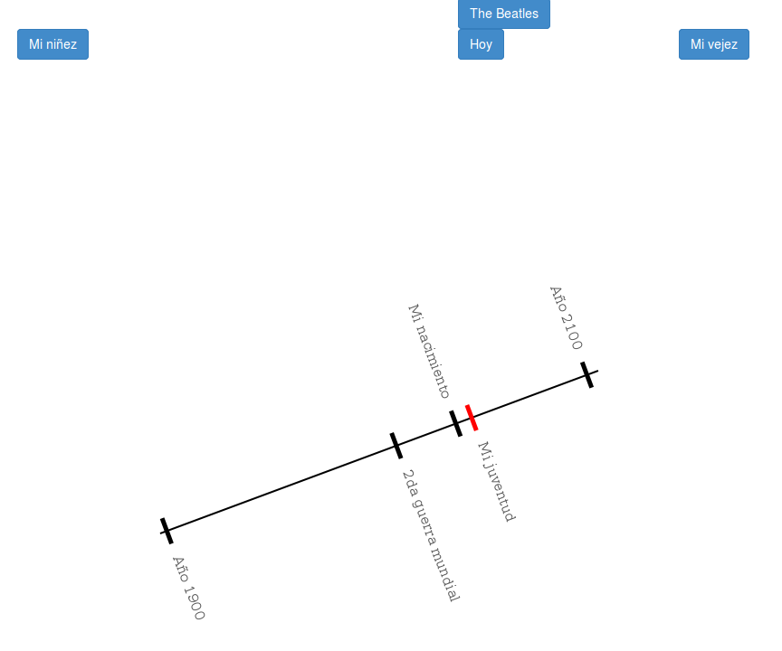

  
```{r global_options, include=FALSE}
library(knitr)
opts_chunk$set(echo=FALSE, warning=FALSE, message=FALSE, results='asis')
opts_knit$set(global.par=TRUE)

library(pander)
panderOptions("table.split.table" , Inf) # avoid to split the tables
```

```{r import}
library(ggplot2)
library(GGally)
library(ggparallel)
library(broom)
library(gplots)
library(granovaGG)
library(Rmisc)
library(vcd)
library(entropy)
library(lme4)
library(lmerTest)
library(Deducer) # XXX: must be after lme4 to avoid an error
library(scales)
library(ca)
library(circular)
library(multcomp)
source("scripts/utils.R")
source("scripts/data_loading.R")
source("scripts/rsquaredglmm.R")
source("scripts/results_builder.R")

par(font.lab = 3, cex.lab = 1.1)

experiment_data = ExperimentData$new("data/output/")
experiments = experiment_data$flat_all()
results_builder = ResultsBuilder$new()
```

# Presente, pasado y futuro



```{r}
current_stage = 'present_past_future'
long_stage = experiment_data$recursive(current_stage)
wide_stage = experiment_data$flat(current_stage)
```

```{r, child='template_ubicacion_xy.Rmd', eval=TRUE}
```

## Tamaños de los elementos

```{r}
plotmeans(radius ~ element, long_stage, xlab = "Figura", ylab = "Radio", n.label = F,
          legends = experiment_data$schema()$element_translation[[current_stage]])
```

Test ANOVA para el radio de los elementos.

```{r}
fit_mm = lmer(radius ~ element + (1|experiment_id), data=long_stage)
results_builder$add_mixed_model(current_stage, 'size_xy', fit_mm)
```

```{r, results='markup'}
#summary(fit_mm)
anova(fit_mm)
glht(fit_mm, linfct=mcp(element="Tukey")) %>% summary()
```

## Orden de selección

Test de Chi^2 para uniformidad.

```{r}
a_table = table(wide_stage$select_order)
results_builder$add_counts(current_stage, 'select_order', a_table)

result = tidy(chisq.test(a_table))
pander(result)
```

```{r, child='template_colores.Rmd', eval=TRUE}
```

# Estaciones del año



```{r}
current_stage = 'seasons_of_year'
long_stage = experiment_data$recursive(current_stage)
wide_stage = experiment_data$flat(current_stage)
```

```{r, child='template_ubicacion_xy.Rmd', eval=TRUE}
```

## Tamaños de los elementos

Estudiaremos por separado el área de la relación entre el alto y ancho.

```{r}
my_data = mutate(long_stage,
  area_sqrt = sqrt(size_x * size_y),
  width_vs_height = my.relative_difference_log(size_x, size_y)
)
```

Primero veamos la raíz cuadrada del área.

```{r}
plotmeans(area_sqrt ~ element, data=my_data, xlab = "Figura", ylab = expression(sqrt("Área(figura)")), n.label = F,
          legends = experiment_data$schema()$element_translation[[current_stage]])
```

```{r}
fit_mm = lmer(area_sqrt ~ element + (1|experiment_id), data=my_data)
results_builder$add_mixed_model(current_stage, 'size', fit_mm)
```

```{r, results='markup'}
#summary(fit_mm)
anova(fit_mm)
glht(fit_mm, linfct=mcp(element="Tukey")) %>% summary()
```

Luego veamos la diferencia relativa entre ancho y alto.

```{r}
plotmeans(width_vs_height ~ element, data=my_data, xlab = "Figura", ylab = expression(RelDiff(Tamaño[X], Tamaño[Y])), n.label = F,
          legends = experiment_data$schema()$element_translation[[current_stage]])
```

```{r}
fit = lm(width_vs_height ~ element, data=my_data)

pander(tidy(anova(fit)))
pander(glance(fit))
#pander(tidy(TukeyHSD(aov(fit))))
```

## Orden de selección

Test de Chi^2 para uniformidad.

```{r}
a_table = table(wide_stage$select_order)
results_builder$add_counts(current_stage, 'select_order', a_table)

result = tidy(chisq.test(a_table))
pander(result)
```

```{r, child='template_colores.Rmd', eval=TRUE}
```

# Días de la semana



```{r}
current_stage = 'days_of_week'
long_stage = experiment_data$recursive(current_stage)
wide_stage = experiment_data$flat(current_stage)
```

```{r, child='template_ubicacion_xy.Rmd', eval=TRUE}
```

El caso del domingo se explica porque para algunos está al comienzo y para otros al final.

```{r}
ggplot(filter(long_stage, element == "sunday"), aes(x = center_x)) +
  geom_histogram(binwidth=15, color="grey40", fill="#00aeff") +
  labs(x = expression(paste(Posición[X], " del domingo")), y = "Cantidad de sujetos")
```

## Tamaños de los elementos

```{r, fig.width=8}
plotmeans(size_y ~ element, long_stage, xlab = "Figura", ylab = expression(Tamaño[Y]), n.label = F,
          legends = experiment_data$schema()$element_translation[[current_stage]])
```

Test ANOVA para el alto de los elementos.

```{r}
fit_mm = lmer(size_y ~ element + (1|experiment_id), data=long_stage)
results_builder$add_mixed_model(current_stage, 'size_y', fit_mm)
```

```{r, results='markup'}
#summary(fit_mm)
anova(fit_mm)
glht(fit_mm, linfct=mcp(element="Tukey")) %>% summary()
```

## Posición y tamaño

Como medimos la posición del centro de la figura, y los sujetos suelen alinear los días, se confunde el efecto de cambios de posición en Y como de altura. Por eso vamos a utilizar ANOVA con el modelo lineal para medirlos (`center_y ~ element + size_y`).

```{r}
fit = lm(center_y ~ element + size_y, data=long_stage)
pander(tidy(anova(fit)))
pander(glance(fit))
```

Aquí vemos que la posición en Y se explica más por el tamaño que por el día de la semana. Es decir, cuanto más altas sean las figuras, menos posibilidades hay para ubicar el centro (ya que no pueden salir del canvas).

```{r}
ggplot(long_stage, aes(x = size_y, y = center_y)) + geom_point(alpha = 0.5) + scale_y_reverse()
temp_df = mutate(long_stage, center_y_rel = 0.5+(center_y-250)/(500-size_y))
ggplot(temp_df, aes(x = size_y, y = center_y_rel)) + geom_point(alpha = 0.6) + scale_y_reverse()
```

## Orden de selección

Test de Chi^2 para uniformidad.

```{r}
all_permutations = factorial(length(levels(long_stage$element)))
num_subjects = length(levels(long_stage$experiment_id))
case_proportions = data.frame(
  Var1 = factor(c('monday_first', 'not_ordered', 'sunday_first')),
  Freq = c(1, all_permutations - 2, 1),
  case = 'expected'
)
expected_counts = mutate(case_proportions,
  Freq = round(Freq / all_permutations * num_subjects)
)
actual_counts = data.frame(table(wide_stage$select_order), case = 'actual')

my_df = rbind(actual_counts, expected_counts)
my_table = xtabs(Freq ~ Var1 + case, my_df)

results_builder$add_table(current_stage, 'select_order', my_table)
result = tidy(chisq.test(my_table))
pander(my_table)
pander(result)
```

```{r, child='template_colores.Rmd', eval=TRUE}
```

# Partes del día



```{r}
current_stage = 'parts_of_day'
long_stage = experiment_data$recursive(current_stage)
wide_stage = experiment_data$flat(current_stage)
```

## Ubicación del centro

Test ANOVA entre grupos.

```{r, results='markup'}
long_stage$rotation = circular(long_stage$rotation, units = "degrees")
fit <- with(long_stage, aov.circular(rotation, element))
fit_df = with(fit, data.frame(Mu = as.vector(mu), Kappa = as.vector(kappa), Rho = as.vector(rho)))

fit
```

```{r}
pander(fit_df)
```

Gráfico de densidades y medias.

```{r}
plot.circular(circular(c(0), units="degrees"), pch=NA, shrink = 1.15)

day_colors = list(
  morning = 2, afternoon = 3, night = 4
)
day_data = lapply(levels(long_stage$element), function(x) {
  section = long_stage$rotation[long_stage$element == x]
  density = density.circular(section, bw = 150)
  mean_ci = mle.vonmises.bootstrap.ci(section)
  
  lines.circular(density$x, density$y, shrink = 1.15, offset = 1.05, col = day_colors[[x]])
  #ticks.circular(mean_ci$mu.ci, tcl = 0.1, col = day_colors[[x]])
})

#arrows.circular(circular(fit_df$Mu, units = "degrees"), col = as.numeric(day_colors))
legend("topleft", c('Mañana', 'Tarde', 'Noche'), lty = rep(1, length(day_colors)),
       lwd = rep(2.5, length(day_colors)), col = as.numeric(day_colors))
```

## Tamaños de los elementos

```{r}
plotmeans(size ~ element, long_stage, xlab = "Figura", ylab = "Tamaño", n.label = F,
          legends = experiment_data$schema()$element_translation[[current_stage]])
```

Test ANOVA para el tamaño de los elementos.

```{r}
fit_mm = lmer(size ~ element + (1|experiment_id), data=long_stage)
results_builder$add_mixed_model(current_stage, 'size_xy', fit_mm)
```

```{r, results='markup'}
#summary(fit_mm)
anova(fit_mm)
glht(fit_mm, linfct=mcp(element="Tukey")) %>% summary()
```

## Orden de selección

Test de Chi^2 para uniformidad.

```{r}
a_table = table(wide_stage$select_order)
results_builder$add_counts(current_stage, 'select_order', a_table)

result = tidy(chisq.test(a_table))
pander(result)
```

```{r, child='template_colores.Rmd', eval=TRUE}
```

# Línea de tiempo



```{r}
current_stage = 'timeline'
long_stage = experiment_data$recursive(current_stage)
wide_stage = experiment_data$flat(current_stage)
```

## Ubicación

```{r, fig.width=12}
plotmeans(position ~ element, long_stage, xlab = "Figura", ylab = "Posición", n.label = F,
          legends = experiment_data$schema()$element_translation[[current_stage]])
```

Test ANOVA entre grupos.

```{r}
fit_mm = lmer(position ~ element + (1|experiment_id), data=long_stage)
results_builder$add_mixed_model(current_stage, 'position_x', fit_mm)
```

```{r, results='markup'}
#summary(fit_mm)
anova(fit_mm)
glht(fit_mm, linfct=mcp(element="Tukey")) %>% summary()
```

# Resumen

Los tests que se realizaron son dentro de cada etapa, para ver si hay una influencia de la variable "elemento" en otras.

- `position_xy`: indica si afecta ambos ejes de la posición, ya sea en conjunto a dos variables o a una única variable que no se corresponda con ejes (por ejemplo, rotación para las partes del día).
- `position_x`: indica si afecta la posición horizontal de la figura.
- `position_y`: indica si afecta la posición vertical de la figura.
- `size_xy`: indica si afecta ambos ejes del tamaño, o a una única variable que no se corresponda con ejes (por ejemplo, radio o tamaño del sector circular).
- `size_x`: indica si afecta el ancho de la figura.
- `size_y`: indica si afecta el alto de la figura.
- `select_order`: indica si el orden de selección de los botones es uniforme (por ejemplo, si eligieron "pasado-presente-futuro" la misma cantidad de veces que "futuro-pasado-presente").
- `color`: indica si los colores se distribuyen de manera diferente según el elemento (por ejemplo, si hay más verde en el futuro que en el pasado o presente).

Para cada uno tenemos el *p-value* (hay diferencia), y *r-squared* (cuánto es la diferenca, en términos de varianza explicada o medida de asociación para tablas de frecuencias).
Para los casos que aplique, también tenemos *conditional r-squared*, la varianza explicada solamente por los sujetos (por ejemplo, si alguno hace los elementos más grandes independientemente de cuál es cuál).

## Tabla

```{r}
results_df = results_builder$get_results()
write.csv(results_df, file = "hipotesis_primarias.csv", row.names = F)
pander(results_df)
```

## Gráficos

```{r}
common_plot_opts = function(p) {
  p +
    aes(color = stage, group = stage) +
    geom_line(size = 2, alpha = 0.5) +
    geom_point(size = 5, alpha = 0.7) +
    theme(axis.text.x = element_text(angle = 90)) +
    xlab("")
}

ggplot(results_df, aes(x = test, y = p_value)) %>% common_plot_opts() +
  scale_y_log10()

results_df %>% filter(p_value < 0.05) %>%
  ggplot(aes(x = test, y = r_squared)) %>% common_plot_opts() +
  scale_y_continuous(breaks=pretty_breaks(n=10))

another_df = results_df[!is.na(results_df$mm_r_squared),]
another_df %>% filter(p_value < 0.05) %>%
  ggplot(aes(x = test, y = mm_r_squared)) %>% common_plot_opts() +
  scale_y_continuous(breaks=pretty_breaks(n=10))
```